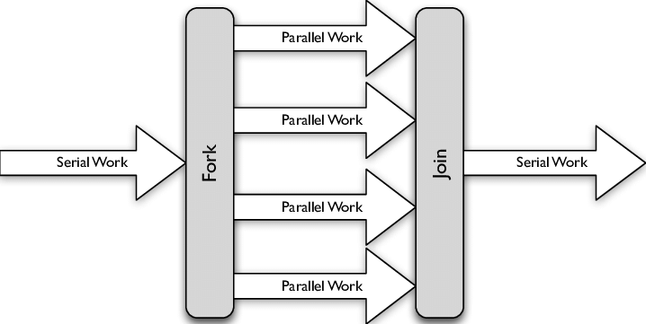

# Fork/Join Pool The Ripper

[English](#english) · [Українська](#українська)

## English
In order to understand why we need the Fork/Join pool and how it can help us we can try to write our own MergeSort implementation that performs work in several threads.

```java
    public class MergeSortThread {
        @SneakyThrows
        public static void mergeSort(int[] arr) {
            System.out.println("Thread: " + Thread.currentThread().getName());
            if (arr.length < 2) return;
            int n = arr.length / 2;
            int[] left = Arrays.copyOfRange(arr, 0, n);
            int[] right = Arrays.copyOfRange(arr, n, arr.length);

            Thread leftThread = new Thread(() -> mergeSort(left));
            leftThread.start();
            Thread rightThread = new Thread(() -> mergeSort(right));
            rightThread.start();
            leftThread.join();
            rightThread.join();
            merge(arr, left, right);
        }

        private static void merge(int[] arr, int[] left, int[] right) {
            int i = 0, j = 0;
            while (i < left.length && j < right.length) {
                if (left[i] > right[j]) {
                    arr[i + j] = right[j++];
                } else {
                    arr[i + j] = left[i++];
                }
            }
            System.arraycopy(left, i, arr, i + j, left.length - i);
            System.arraycopy(right, j, arr, i + j, right.length - j);
        }
    }
```

Here, for each division of the array, we will manually create two threads. The problem will be that we will create a large number of threads very quickly. My machine managed to create 5,000 threads before it crashed due to lack of memory. 
    
Ok, we could independently divide the array into 2-4 parts and separately manually run them in several threads:

Example with 2 threads:
   

Example with 4 threads:


And it worked — the job indeed took two to four times less time.

Creating threads manually violates the SOLID Single Responsibility principle; it's better to delegate thread management to an ExecutorService:


So we split the work into parts and executed each part in a separate thread, and since each part ran on a separate CPU core we were able to improve performance.

For this algorithm, this might be the optimal approach.

How can we further improve performance?

Broadly speaking there are three main stages:
1. Split the task into parts (this happens in the main thread)
2. Execute each part of the task in parallel on worker threads
3. In the main thread wait for all parts to finish and then combine (merge) the result.



In stage #1 only one thread is working, in stage #2 all worker threads (except main) run, and in stage #3 only the main thread works again.

In stages #1 and #3 the work runs sequentially on a single thread, so we don't use parallelism there (remember Amdahl's law: https://en.wikipedia.org/wiki/Amdahl%27s_law).

Also, if the task is imbalanced or there are unpredictable delays (for example I/O), or the machine shares resources with other processes, some worker threads in stage #2 will finish earlier and sit idle, waiting — just like the main thread — until slower tasks complete. That means not all available hardware resources will be utilized (hardware resource utilization).

Let's try to optimize these stages — parallelize them by pushing work further into worker threads.

If we try to split the array and perform sorting inside MergeSort using an ExecutorService with a limited thread pool, it might look like this:

```java
@RequiredArgsConstructor
public class MergeSortExecutor {

    private final int[] arr;
    private final ExecutorService executor;

    @SneakyThrows
    protected void merge() {
        if (arr.length < 2) return;
        var n = arr.length / 2;
        var left = Arrays.copyOfRange(arr, 0, n);
        var right = Arrays.copyOfRange(arr, n, arr.length);
        var leftFuture = executor.submit(() -> new MergeSortExecutor(left, executor).merge());
        var rightFuture = executor.submit(() -> new MergeSortExecutor(right, executor).merge());

        System.out.println("Waiting for the result of left sorting");
        leftFuture.get(); // blocks thread
        System.out.println("Waiting for the result of right sorting");
        rightFuture.get(); // blocks thread

        merge(arr, left, right);
    }

    private void merge(int[] arr, int[] left, int[] right) {
        int i = 0, j = 0;
        while (i < left.length && j < right.length) {
            if (left[i] > right[j]) {
                arr[i + j] = right[j++];
            } else {
                arr[i + j] = left[i++];
            }
        }
        System.arraycopy(left, i, arr, i + j, left.length - i);
        System.arraycopy(right, j, arr, i + j, right.length - j);
    }
}
```

Run:


And we see that all available threads are exhausted.

The problem is that the `get()` call blocks the thread and all threads from our pool become blocked.

Now it becomes harder to organize correct thread management.

This is where the ForkJoin pool helps — it extends the capabilities of a regular executor.

ForkJoinPool is a subclass of ExecutorService. This pool accepts a special kind of tasks: `ForkJoinTask`.

```java
invoke(ForkJoinTask<T> task)
```

The main concrete implementations are `RecursiveTask` and `RecursiveAction`. Each of them has an abstract `compute()` method that you must implement. `RecursiveTask#compute()` returns a value, `RecursiveAction#compute()` returns void.

```java
@Override
protected void compute() {
    if (arr.length < 2) return;
    var n = arr.length / 2;
    var left = Arrays.copyOfRange(arr, 0, n);
    var right = Arrays.copyOfRange(arr, n, arr.length);
    var leftAction = new MergeSortAction(left);
    var rightAction = new MergeSortAction(right);

    leftAction.fork();
    rightAction.fork(); // fork() here is redundant for the right part, it's better to call compute() method directly
    
    leftAction.join();
    rightAction.join();
    
    merge(arr, left, right);
}
```

Here the `fork()` call is almost the same as `executor.submit(Runnable)` — it tells the ForkJoin pool we want to split the work and run a separate task that will execute on another worker thread.

The `join()` method is used when we need the task's result. In practice `join()` does not block the native thread: the worker thread can temporarily switch to other pending tasks. That means our threads will not be blocked and will not be exhausted.

The fact that `join()` does not occupy a thread is the main advantage of the Fork/Join pool — it tries to schedule and balance tasks across worker threads efficiently.


---

## Українська

Можливо, щоб зрозуміти, навіщо нам потрібен Fork/Join і що він дозволяє робити, можна спробувати написати власну реалізацію MergeSort, яка виконує роботу в кількох потоках.

```java
    public class MergeSortThread {
        @SneakyThrows
        public static void mergeSort(int[] arr) {
            System.out.println("Thread: " + Thread.currentThread().getName());
            if (arr.length < 2) return;
            int n = arr.length / 2;
            int[] left = Arrays.copyOfRange(arr, 0, n);
            int[] right = Arrays.copyOfRange(arr, n, arr.length);

            Thread leftThread = new Thread(() -> mergeSort(left));
            leftThread.start();
            Thread rightThread = new Thread(() -> mergeSort(right));
            rightThread.start();
            leftThread.join();
            rightThread.join();
            merge(arr, left, right);
        }

        private static void merge(int[] arr, int[] left, int[] right) {
            int i = 0, j = 0;
            while (i < left.length && j < right.length) {
                if (left[i] > right[j]) {
                    arr[i + j] = right[j++];
                } else {
                    arr[i + j] = left[i++];
                }
            }
            System.arraycopy(left, i, arr, i + j, left.length - i);
            System.arraycopy(right, j, arr, i + j, right.length - j);
        }
    }
```

Тут для кожного розбиття масиву ми вручну створюємо по два потоки. Проблема в тому, що дуже швидко буде створено велику кількість потоків. Моя машина зуміла створити 5 000 потоків до того, як впала через брак пам'яті.

    

Гаразд, ми могли б самостійно розділити масив на 2–4 частини і окремо вручну запустити їх у кількох потоках:

Приклад для 2 потоків:
   

Приклад для 4 потоків:


І це спрацювало — робота справді зайняла в два–чотири рази менше часу.

Створення потоків вручну суперечить принципу Single Responsibility з SOLID; краще делегувати це `ExecutorService`:


Отже, ми розбили роботу на частини і виконали кожну частину в окремому потоці, і оскільки кожна частина виконувалася на окремому ядрі процесора, ми змогли підвищити продуктивність.

Для цього алгоритму це може бути оптимальним підходом.

Як ми можемо ще покращити продуктивність?

У загальному вигляді можна виділити три основні етапи:
1. розділити задачу на частини (це відбувається в головному потоці)
2. виконати кожну частину задачі паралельно у воркер-потоках
3. в головному потоці дочекатися завершення всіх частин і зібрати (змерджити) результат.


На етапі №1 працює лише один потік, на етапі №2 працюють усі воркер-потоки (окрім main), а на етапі №3 знову працює лише головний потік.

На етапах №1 та №3 робота виконується послідовно в одному потоці, тому тут не використовується перевага паралельного виконання (не забуваймо про закон Амдала: https://en.wikipedia.org/wiki/Amdahl%27s_law).

Також, якщо задача нерівномірна або виникають непередбачувані затримки (наприклад, I/O), або машина ділить ресурси з іншими процесами, то деякі воркер-потоки на етапі №2 завершать свою роботу раніше і стоятимуть вільно (idle), очікуючи — як і головний потік — поки повільніші задачі не завершаться. Це означає, що не всі доступні апаратні ресурси будуть використані (hardware resource utilization).

Спробуємо оптимізувати ці етапи — розпаралелити їх, переклавши роботу далі на воркер-потоки.

Якщо спробувати розбивати масив і виконувати сортування всередині MergeSort, використовуючи `ExecutorService` з обмеженим пулом потоків, код може виглядати так:

```java
@RequiredArgsConstructor
public class MergeSortExecutor {

    private final int[] arr;
    private final ExecutorService executor;

    @SneakyThrows
    protected void merge() {
        if (arr.length < 2) return;
        var n = arr.length / 2;
        var left = Arrays.copyOfRange(arr, 0, n);
        var right = Arrays.copyOfRange(arr, n, arr.length);
        var leftFuture = executor.submit(() -> new MergeSortExecutor(left, executor).merge());
        var rightFuture = executor.submit(() -> new MergeSortExecutor(right, executor).merge());

        System.out.println("Waiting for the result of left sorting");
        leftFuture.get(); // блокує потік
        System.out.println("Waiting for the result of right sorting");
        rightFuture.get(); // блокує потік

        merge(arr, left, right);
    }

    private void merge(int[] arr, int[] left, int[] right) {
        int i = 0, j = 0;
        while (i < left.length && j < right.length) {
            if (left[i] > right[j]) {
                arr[i + j] = right[j++];
            } else {
                arr[i + j] = left[i++];
            }
        }
        System.arraycopy(left, i, arr, i + j, left.length - i);
        System.arraycopy(right, j, arr, i + j, right.length - j);
    }
}
```

Запуск:


І ми бачимо, що всі доступні потоки вичерпані.

Проблема в тому, що виклик `get()` блокує потік, і всі потоки з нашого пулу опиняються в стані блокування.

Тепер організувати правильне управління потоками стає складніше.

Тут нам на допомогу приходить ForkJoin-пул, який розширює можливості звичайних екзек'юторів.

`ForkJoinPool` є підкласом `ExecutorService`. Цей пул приймає до виконання особливий тип задач — `ForkJoinTask`.

```java
invoke(ForkJoinTask<T> task)
```

Основні реалізації — `RecursiveTask` та `RecursiveAction`. У кожного з них є абстрактний метод `compute()`, який потрібно реалізувати. `RecursiveTask#compute()` повертає значення, `RecursiveAction#compute()` — void.

```java
@Override
protected void compute() {
    if (arr.length < 2) return;
    var n = arr.length / 2;
    var left = Arrays.copyOfRange(arr, 0, n);
    var right = Arrays.copyOfRange(arr, n, arr.length);
    var leftAction = new MergeSortAction(left);
    var rightAction = new MergeSortAction(right);

    leftAction.fork();
    rightAction.fork(); // .fork() для правої частини тут зайве, краще викликати compute() безпосередньо
    
    leftAction.join();
    rightAction.join();
    
    merge(arr, left, right);
}
```

Виклик `fork()` майже те саме, що і `executor.submit(Runnable)` — ми повідомляємо ForkJoin-пулу, що хочемо розпаралелити виконання і запустити окрему таску, яка виконається в іншому воркер-потоці.

Метод `join()` ми використовуємо коли нам потрібен результат таски. Насправді `join()` не блокує нативний потік: воркер-потік тимчасово може переключитися на інші задачі. Це означає, що наші потоки не будуть заблоковані і не закінчаться.

Те, що `join()` не займає потік — ось основна перевага Fork/Join пулу: він намагається правильно розподілити і збалансувати задачі між воркер-потоками.


