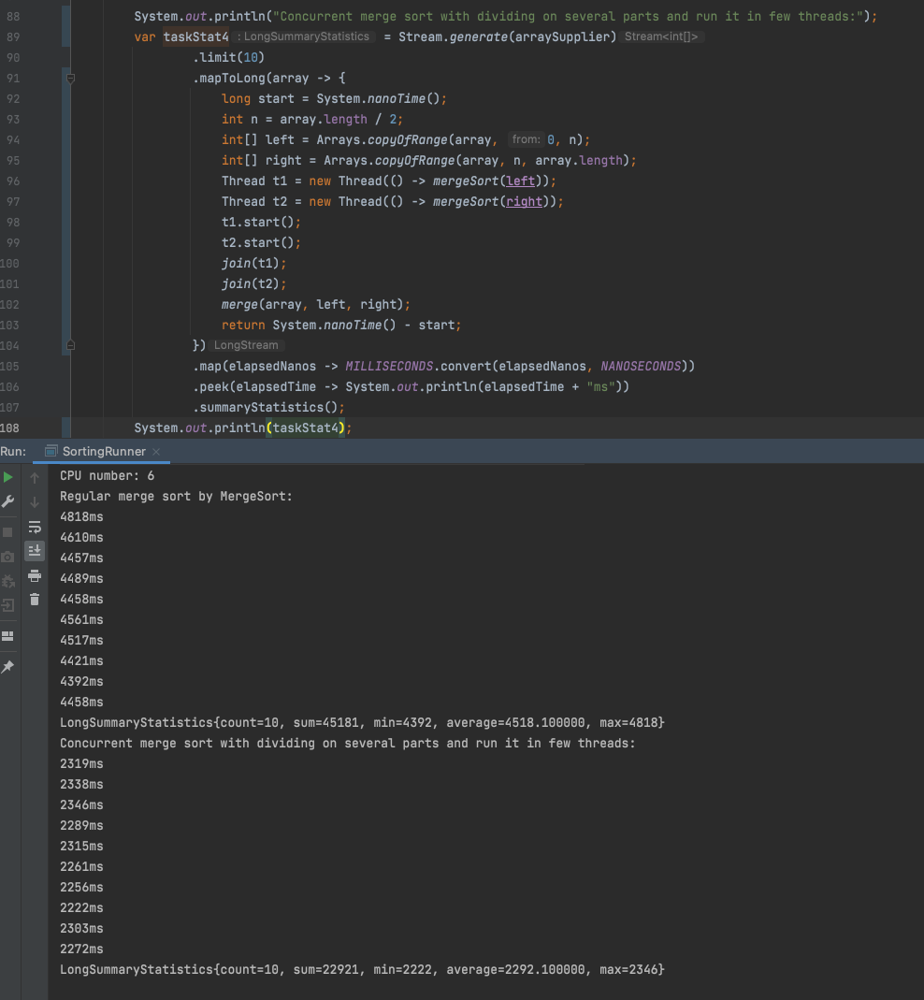
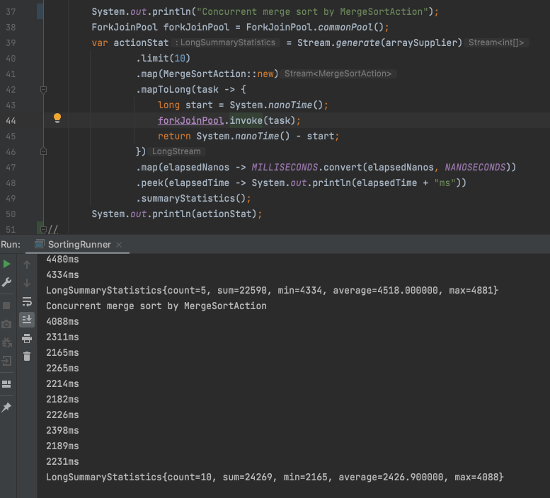

# Fork/Join Pool The Ripper

Может быть, чтобы понять для чего нам ForkJoin и что он позволяет делать, можно попробовать написать свою реализацию MergeSort которая выполняет работу в нескольких потоках.


    public class MergeSortThread {
        @SneakyThrows
        public static void mergeSort(int[] arr) {
            System.out.println("Thread: " + Thread.currentThread().getName());
            if (arr.length < 2) return;
            int n = arr.length / 2;
            int[] left = Arrays.copyOfRange(arr, 0, n);
            int[] right = Arrays.copyOfRange(arr, n, arr.length);

            Thread leftThread = new Thread(() -> mergeSort(left));
            leftThread.start();
            Thread rightThread = new Thread(() -> mergeSort(right));
            rightThread.start();
            leftThread.join();
            rightThread.join();
            merge(arr, left, right);
        }

        private static void merge(int[] arr, int[] left, int[] right) {
            int i = 0, j = 0;
            while (i < left.length && j < right.length) {
                if (left[i] > right[j]) {
                    arr[i + j] = right[j++];
                } else {
                    arr[i + j] = left[i++];
                }
            }
            System.arraycopy(left, i, arr, i + j, left.length - i);
            System.arraycopy(right, j, arr, i + j, right.length - j);
        }
    }

Здесь на каждое деление массива мы будем вручную создавать два потока. Проблема будет в том что мы очень быстро создадим большое количество потоков. Моей машине удалось создать 5 тысяч потоков до того как она свалилась из-за отсутствия памяти.

    

Ок мы могли бы самостоятельно поделить массив на 2-4 части и отдельно вручную запустить их в нескольких потоках:

Пример на 2 потока:
   
Пример на 4 потока:


И это сработало - действительно работа заняла в два-четыре раза меньше времени.

Создавать потоки вручную не по SOLID Single Responsibility принципу, лучше поручить это ExecutorService:


Итак, мы разбили работу на части и выполнили каждую часть в отдельном потоке, и т.к. каждая часть выполнялась на отдельном ядре процессора мы смогли улучшить производительность. 

В данном примере для данного алгоритма возможно это оптимальный способ. 

Как мы можем еще улучшить производительность? 

В целом у нас здесь 3 этапа:
1. поделить задачу на части (это мы делаем в main потоке)
2. выполнить каждую часть задачи параллельно в потоках
3. в потоке main дождаться выполнения всех частей и собрать (смержить) результат.


На первом этапе работает только один поток, на втором этапе работают все потоки кроме main, на третьем этапе снова работает только main поток.

Давайте попробуем оптимизировать 1-й и 3-й этапы, переложить работу на несколько потоков. 

Если бы мы попытались бы внутри MergeSort делить массив и выполнять сортировку в отдельных потоках:

```java

@RequiredArgsConstructor
public class MergeSortExecutor {

    private final int[] arr;
    private final ExecutorService executor;

    @SneakyThrows
    protected void merge() {
        if (arr.length < 2) return;
        var n = arr.length / 2;
        var left = Arrays.copyOfRange(arr, 0, n);
        var right = Arrays.copyOfRange(arr, n, arr.length);
        var leftFuture = executor.submit(() -> new MergeSortExecutor(left, executor).merge());
        var rightFuture = executor.submit(() -> new MergeSortExecutor(right, executor).merge());

        System.out.println("Waiting for the result of left sorting");
        leftFuture.get(); // blocks thread
        System.out.println("Waiting for the result of right sorting");
        rightFuture.get(); // blocks thread

        merge(arr, left, right);
    }

    private void merge(int[] arr, int[] left, int[] right) {
        int i = 0, j = 0;
        while (i < left.length && j < right.length) {
            if (left[i] > right[j]) {
                arr[i + j] = right[j++];
            } else {
                arr[i + j] = left[i++];
            }
        }
        System.arraycopy(left, i, arr, i + j, left.length - i);
        System.arraycopy(right, j, arr, i + j, right.length - j);
    }
}
```
Запускаем:


И видим что все доступные потоки закончились.

Проблема в том что метод `get()` блокирует поток и все потоки из нашего пула заблокировались.

Здесь уже сложнее организовать правильное управление потоками.

Тут приходит на помощь ForkJoin пул который расширил возможности обычных экзекьюторов.

ForkJoinPool является наследником ExecutorService. Этот пул принимает на выполнение особый тип тасок `ForkJoinTask`. 
```java 
invoke(ForkJoinTask<T> task)
```
Основные реализации – RecursiveTask и RecursiveAction. У каждого из них есть абстрактный метод `compute()`, который и надо реализовывать при наследовании. `RecursiveTask#compute()` возвращает некое значение, `RecursiveAction#compute()` возвращает void.

```java
@Override
protected void compute() {
    if (arr.length < 2) return;
    var n = arr.length / 2;
    var left = Arrays.copyOfRange(arr, 0, n);
    var right = Arrays.copyOfRange(arr, n, arr.length);
    var leftAction = new MergeSortAction(left);
    var rightAction = new MergeSortAction(right);

    leftAction.fork();
    rightAction.fork(); // fork() here is redundant for the right part, it's better to call compute() method directly
    
    leftAction.join();
    rightAction.join();
    
    merge(arr, left, right);
}
```
Здесь вызов метода `fork()` это почти то же самое как вызов метода `executor.submit(Runnable)`  говорит ForkJoin пулу что мы хотим здесь распараллелить выполнение, запустить отдельную таску которая выполниться в другом потоке-воркере.
Метод `join()` мы используем когда хотим сказать пулу, что дальше нам нужны результаты таски. На самом деле этот метод не блокирует нативный поток, таким образом поток-воркер может пока переключиться на другую таску. Значит у нас потоки не заблокируются и не закончатся.
То что `join()` не занимает поток - в этом и есть преимущество Fork/Join пула, он пытается правильно раздать задачи потокам-воркерам.


